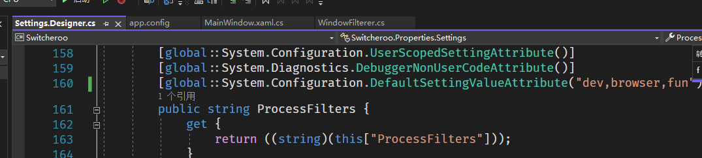

# 改动  
- 修复输入法冲突
- 增加程序过滤器, 鼠标单击或快捷键Alt+1,2,3,4, 可以在switcheroo.settings里修改过滤的程序;

# 备注

关键代码在 MainWindow.xaml.cs 里的 TextChanged 函数

```
if (this.processFilterText == "dev")
{
    List<string> apps =  new List<string> { "code", "webstorm", "visual", "github desktop", "terminal" };

    foreach (string appName in apps)
    {
        var temp = new WindowFilterer().Filter(context, appName).ToList();
        foreach (var temp1 in temp)
        {
            filterResults.Add(temp1);
        }
    }
}
```

默认配置写死: dev  browser  fun



配置文件: [switcheroo.settings](.\Switcheroo\bin\Debug)
